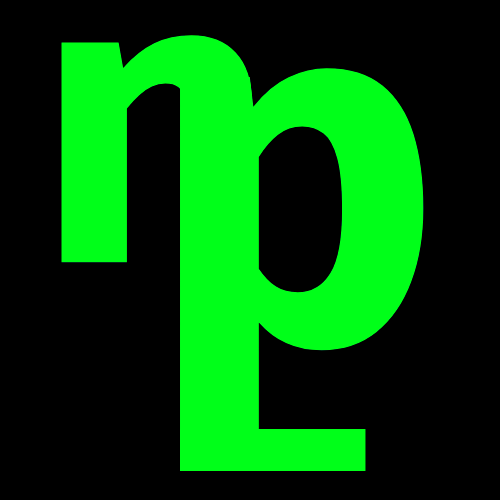

<p align="center">
  
</p>

<h1 align="center">npl — nano programming language</h1>

npl is the easiest programming language to learn that is not blocky or stinky. You can program like it is just your regular coding session, but with a smaller footprint on your PC, and the most seamless experience for any programmer: fewer deps, more understandable and less syntax, and shorter code for big jobs.

NPL is written in **assembly**, making it genuinely lightweight from the ground up. The most minimal hardware you can run NPL on is a first-gen Raspberry Pi with 256MB of RAM. Or use **mnpl** (micro NPL) for microcontrollers, which require a Pi Pico at minimum.

## *Easily* integrate with any IDE
## *Add* your plugins and libraries
## *Start* coding in seconds
## *Integrate* with different languages
## *Experience* your code faster than ever
## *Run* it on any device
See? **EASIER.**

### Libraries
Libraries? Nahh, we have a librarian. Libraries cover everything: for artists (canvas), math nerds (fath), software and game devs, and more. Just use:

```
npl librarian -i yourlib
```
to use our pkg manager, librarian. Here's Python's pkg manager:
```
python3 -m pip install yourlib --break-system-packages
```
### HawkTUI
The most user-friendly TUI you can imagine. For developers: drafts you only need to fill in and distribute. For users: fast, optimized, and sleek.

### Installers
NPL is the best language for writing installer scripts. Built-in commands, helpers, and a TUI for that. Export as `.npl` or `.sh` format. When saved as `.sh`, if the user does not have NPL installed, a temporary minimal NPL installation starts automatically. When the installer finishes, the temporary NPL gets deleted.

### Websites
HTML with JS is too complicated. Instead, use HTML, with NPL. The HTML is just a placeholder — the real thing is NPL, with its own libraries to create optimized and good-looking website designs. Write less code, get a better website. Use our automated "htmlizer" tool to compile NPL and HTML into a single file.

### Integrate with Anything
Any project works. Use our bridgers and langizers (htmlizer, pyalizer, etc.) to integrate with code written in different languages.

### STF — SyntaxFree
We removed the taxes. You can actually read them now:

```
Line 33: variable "a" is not defined.
```

So you do not have to decipher a 200-sentence essay. STF for short. For help, use `stfu`.

### Best Language for the Pi
Raspberry Pis and NPL have a lot in common — both are small, but they have big **"things"** in the bottom. We created a dedicated library for every RPi device: GPIO, chips, system, OS, and optimized NPL for these devices to get the best performance and compatibility ever.

### Control Your PC and Beyond
Use the built-in libs to control your PC: media, shell scripts, web fetch, and more.

### Plugin System
Build your plugins to patch or extend NPL. Create and export using your IDE, put the file in your project directory, and type:

```
plug yourplugin
```

Plug anything, they are not billed.

### AI and Education Ready
NPL is a great language to teach in schools, especially for primary school students, for them to truly understand what coding is and to be able to create their own apps and scripts. We have written training data and guides to make even 5-year-olds learn. For beginners, there is a self-debugging IDE built with NPL itself.

## Language Specification

### Entry Point

Every NPL code generally requires ***nplm*** via addlib. — this is the entry point. Order of libraries in addlib does not matter. Execution begins immediately after, top to bottom.

```
addlib nplm, sh, fath
```

> `nplm is generally required. other libs are optional and order-independent.`

### Comments

```
#this is a comment#
```

Comments are wrapped in `#` on both sides. They can appear anywhere on a line.

### Variables

```
var a = 1
var name = "nano"
var pi = 3.14
var nothing = none
```

Variables are declared with `var`. After declaration, reassignment needs no keyword:

```
a = a + 1
```

Types are inferred automatically. NPL supports: integers, floats, strings, and none.

### String Interpolation

Use curly braces inside a string to interpolate variables:

```
text("Hello {name}, you are {age} years old.")
```

### Functions

Single-line function:

```
fn add a b = result a + b
```

Multi-line function:

```
fn greet name /
  text("Hello {name}")
  result name
/
```

Calling a function:

```
greet "nano"
var total = add 3 5
```

**Rules:**
- Arguments are space-separated after the function name.
- `result` returns a single value.
- Variables declared inside a function are local — they do not exist outside it.
- Global variables are declared outside any function.
- Calling a function that returns a value without catching it discards the value silently.

### Block System — Slashes

NPL uses slashes as block delimiters. The slash count represents nesting depth. Opening and closing a block use the same slash count.

```
if a = 1 /          #depth 1#
  loop 10 //        #depth 2#
    while b < 5 /   #depth 3, new block inside loop#
      b = b + 1
    /               #closes depth 3#
  //               #closes depth 2#
/                  #closes depth 1#
```

### Conditionals

```
if a = 1 /
  text("one")
/ else if a = 2 //
  text("two")
// else ///
  text("other")
///
```

Each branch in the chain gets one more slash than the previous. The chain is self-documenting — you always know exactly where you are by counting slashes.

### Loops

Counted loop (repeats N times):

```
loop 10 /
  text("hello")
/
```

While loop:

```
while a < 10 /
  a = a + 1
  wait 0.5
/
```

### Operators

| Operator | Meaning |
|----------|---------|
| `=` | assignment (var) or equality check (if) |
| `!=` | not equal |
| `>` | greater than |
| `<` | less than |
| `>=` | greater or equal |
| `<=` | less or equal |
| `+` | addition |
| `-` | subtraction |
| `*` | multiplication |
| `/` | division |
| `and` | logical and |
| `or` | logical or |
| `not` | logical not |

### Input

```
input("What is your age?"), answer = "age"
text("Your age is: {age}")
```

Input is autodetected — `"10"` becomes an integer, `"3.14"` becomes a float, `"hello"` becomes a string.

### Lists

```
list "my vars" /
2
3
8
/
```

| Syntax | Result |
|--------|--------|
| `"my vars"/-l/` | all items: 2, 3, 8 |
| `"my vars"/-l/ 1` | first item: 2 |
| `"my vars"/-l/ -1` | last item: 8 |
| `"my vars"/-l/ 2:4` | slice: 3, 8 |
| `list "my vars" -c` | count: 3 |
| `"my vars"/-l/ 1 = 99` | mutate first item to 99 |

Lists can hold mixed types: integers, floats, strings, and none.

### Built-in Commands

| Command | Description |
|---------|-------------|
| `text("...")` | print to terminal |
| `wait 0.5` | sleep for 0.5 seconds |
| `nuke` | force stop the program |
| `length "hello"` | returns string length (5) |
| `plug yourplugin` | load a plugin from project dir |

## Libraries

### nplm — NPL Main (core)

Always required. Contains all core language features: variables, functions, loops, conditionals, lists, input, text, wait, nuke, and length.

### sh — Shell

Enables shell passthrough. Always uses `sh` regardless of OS.

```
addlib nplm, sh
```

```
sh> echo "hello from shell"
sh> sudo apt update && sudo apt upgrade
```

Output streams directly to the NPL terminal. No capturing — `var x = sh>` is not valid. Shell errors print as-is and NPL continues.

### fath — Math 

Full math library covering all standard operations.

| Function | Description |
|----------|-------------|
| `mod a b` | modulo |
| `pow a b` | power |
| `sqrt a` | square root |
| `floor a` | floor |
| `ceil a` | ceiling |
| `round a` | round |
| `min a b` | minimum |
| `max a b` | maximum |
| `abs a` | absolute value |
| `log a` | logarithm |
| `sin a` | sine |
| `cos a` | cosine |
| `tan a` | tangent |
| `pi` | constant: 3.14159... |
| `e` | constant: 2.71828... |

### canvas — Graphics

For artists and game developers. Graphics and drawing primitives. (Syntax TBD)

### rpi — Raspberry Pi

Dedicated library for every RPi device. Covers GPIO, chips, system, OS integration, and hardware-level optimizations for maximum performance and compatibility.

### htmlizer — Web

Compile NPL and HTML into a single optimized file. NPL handles all logic, HTML is just a placeholder. Write less code, get a better website.

### pyalizer and other bridgers

Integrate NPL with projects written in other languages. Bridgers handle the translation layer between NPL and the target language.

### HawkTUI — Terminal UI

The most user-friendly TUI framework imaginable. For developers: fill-in-the-blank drafts you can distribute immediately. For users: fast, optimized, and sleek. Used for building installer scripts and interactive terminal apps. (Syntax TBD)

## The Librarian — Package Manager

Install libraries from the community index before using `addlib` in your code.

| Command | Description |
|---------|-------------|
| `npl librarian -i libname` | install a library |
| `npl librarian -r libname` | remove a library |
| `npl librarian -u libname` | update a library |
| `npl librarian -info libname` | info about a library |
| `npl librarian -h` | help |

The librarian pulls from a community-maintained index (a JSON file in a public git repo). Libraries are stored locally. No central server — zero infrastructure cost. Community members submit PRs to add their own tools, libraries, and plugins.

## File I/O

Built-in file operations (part of nplm):

| Command | Description |
|---------|-------------|
| `read "file.txt"` | read file contents |
| `write "file.txt" data` | write data to file (overwrites) |
| `add "file.txt" data` | append data to file |
| `delete "file.txt"` | delete a file |

## Error Handling — STF

NPL does not have try/catch. Errors crash the program and print debug info in plain language. No deciphering required.

Example error output:

```
Line 33: variable "a" is not defined. Did you forget to declare it with var?
Line 12: function "greet" expects 1 argument, got 0.
Line 7: cannot divide by zero.
```

STF (SyntaxFree) is the error system. For help, use `stfu`.

## Platform Support

NPL runs on all Unix systems, Windows, and BSD. The `sh` library always uses `sh` — on Windows, install `sh` yourself.

- **Minimum hardware:** first-gen Raspberry Pi, 256MB RAM.
- **Microcontrollers:** use `mnpl` (micro NPL), Pi Pico minimum.
- **Compiled output:** `.npl`

## Full Example

```
addlib nplm, sh, fath

var a = 1

fn adda = a = a + 1

list "results" /
/

input("What is your name?"), answer = "name"
text("Hello {name}!")

while a < 10 /
  adda
  wait 0.5
/

text("a is now {a}")

if a = 10 /
  text("reached 10!")
  sh> echo "done"
/ else //
  text("something went wrong.")
//

nuke
```
